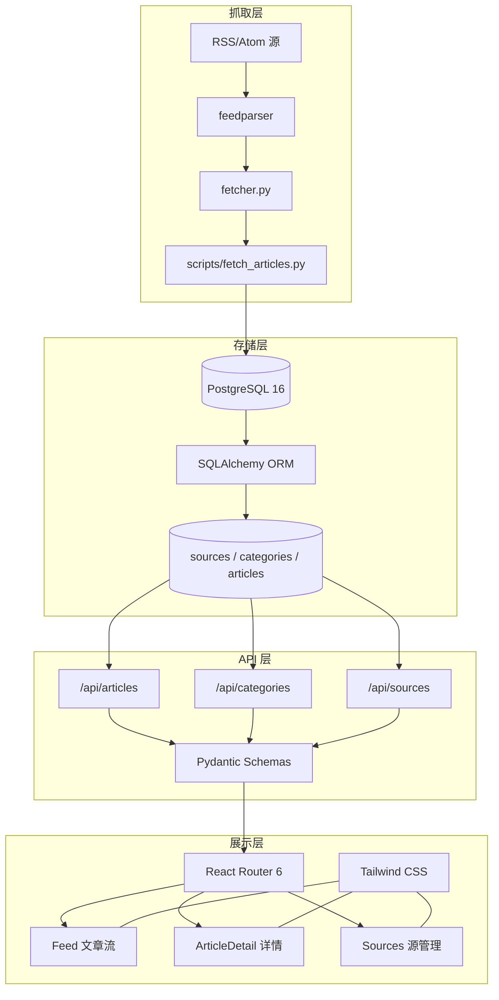
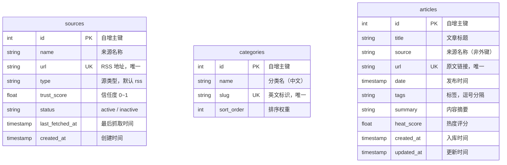
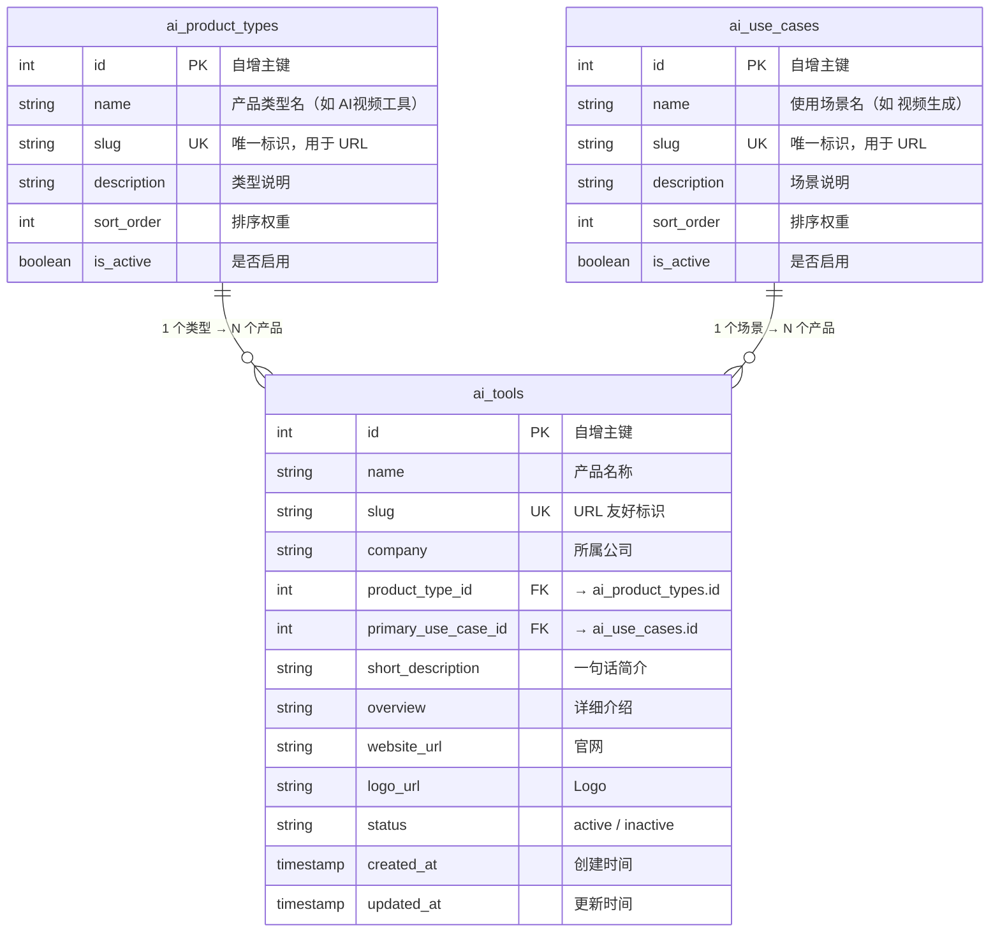
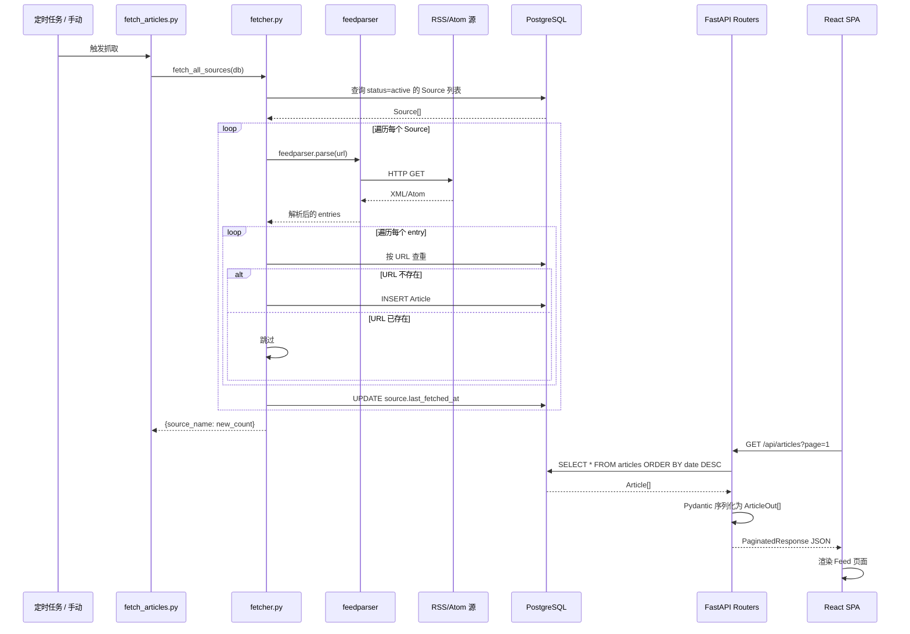

# Tripolar - AI Product Radar

全球 AI 信息聚合平台。自动抓取、清洗、聚类、分析 AI 领域动态。

## 工程架构

### 技术栈总览

| 层级 | 技术 | 职责 |
|------|------|------|
| 前端 | React 18 + Vite + Tailwind CSS + React Router 6 | SPA 页面渲染、路由分发、API 数据消费 |
| 后端 | FastAPI + SQLAlchemy 2.0 + Pydantic | REST API 服务、ORM 映射、请求校验 |
| 数据库 | PostgreSQL 16 | 持久化存储、全文检索 |
| 抓取 | feedparser | RSS/Atom 订阅源解析与去重入库 |
| 部署 | systemd + uvicorn | 进程守护、ASGI 服务运行 |

### 系统架构图



### 目录结构

```
tripolar/
├── backend/
│   ├── app/
│   │   ├── main.py              # FastAPI 应用入口，中间件与路由注册
│   │   ├── config.py            # 环境变量配置（DB/CORS/API Key）
│   │   ├── database.py          # SQLAlchemy 引擎、Session、Base 声明
│   │   ├── models.py            # ORM 模型：Source、Category、Article
│   │   ├── schemas.py           # Pydantic 请求/响应模型
│   │   ├── routers/
│   │   │   ├── articles.py      # /api/articles 端点（列表 + 详情）
│   │   │   ├── categories.py    # /api/categories 端点
│   │   │   ├── sources.py       # /api/sources 端点（CRUD）
│   │   │   └── ai_tools.py       # /api/tools 端点（列表 + 详情 + 元数据）
│   │   └── services/
│   │       └── fetcher.py       # RSS 抓取核心逻辑（按 URL 去重）
│   ├── scripts/
│   │   └── fetch_articles.py    # 独立抓取脚本入口
│   ├── seed.py                  # 种子数据初始化（分类 + RSS 源）
│   └── requirements.txt         # Python 依赖
├── sql/
│   ├── 01_schema.sql             # 全量 DDL（RSS 核心 + AI 工具目录，6 张表）
│   ├── 02_seed_core.sql          # RSS 核心种子数据
│   └── 03_seed_ai_tools.sql      # AI 视频工具种子数据（100 条）
├── frontend/
│   ├── src/
│   │   ├── main.jsx             # React 入口，BrowserRouter 挂载
│   │   ├── App.jsx              # 路由定义（/ /article/:id /sources）
│   │   ├── api/
│   │   │   └── client.js        # fetch 封装，对 /api/* 的统一请求层
│   │   ├── pages/
│   │   │   ├── Feed.jsx         # 文章流主页（分页 + 来源筛选）
│   │   │   ├── ArticleDetail.jsx # 文章详情页
│   │   │   └── Sources.jsx      # RSS 源管理页
│   │   └── components/
│   │       ├── Header.jsx       # 顶部导航栏
│   │       ├── ArticleCard.jsx  # 文章卡片
│   │       ├── CategoryFilter.jsx # 分类筛选按钮组
│   │       ├── Pagination.jsx   # 分页控件
│   │       └── Loading.jsx      # 加载动画
│   ├── index.html               # HTML 入口
│   ├── vite.config.js           # Vite 配置（React 插件 + API 代理）
│   ├── tailwind.config.js       # Tailwind 配置
│   └── package.json             # Node 依赖
├── config/
│   └── urls.txt                 # RSS 源 URL 清单（备选源参考）
├── deploy/
│   └── tripolar-web.service     # systemd 服务单元文件
├── docs/
│   ├── DATABASE.md                           # 数据库总览文档（DDL + 设计 + 运维）
│   └── AI视频工具全量清单 (100个).md           # AI 视频工具原始数据源
├── scripts/
│   └── migrate_to_new_schema.py               # 旧表 → 新三表迁移脚本（历史参考）
└── README.md
```

### 数据模型

三张核心表，`articles.source` 为简单字符串，不与 `sources` 建立外键关联——源可删除而文章不丢失。



- **Source → Article**：通过 `articles.source` 字符串匹配 `sources.name`，松散耦合
- **Category**：独立分类表，当前用于种子数据标签体系（观点洞察 / 产品发布 / 行业报告 / 模型发布 / 论文 / 工具测评）

### AI 工具目录（三表设计）

产品类型回答"它是什么"，使用场景回答"用户用它做什么"。



当前数据规模：5 个产品类型 / 21 个使用场景 / 100 个 AI 视频工具。

### API 端点

| 方法 | 路径 | 参数 | 响应 | 说明 |
|------|------|------|------|------|
| GET | `/api/health` | — | `{status: "ok"}` | 健康检查 |
| GET | `/api/articles` | `page`, `per_page`, `source` | `PaginatedResponse[ArticleOut]` | 文章分页列表，支持来源筛选 |
| GET | `/api/articles/{id}` | — | `ArticleDetail` | 文章详情（含摘要） |
| GET | `/api/categories` | — | `CategoryOut[]` | 全部分类 |
| GET | `/api/sources` | — | `SourceOut[]` | 全部 RSS 源 |
| POST | `/api/sources` | `SourceCreate` body | `SourceOut` (201) | 新增 RSS 源 |
| DELETE | `/api/sources/{id}` | — | 204 | 删除 RSS 源 |
| GET | `/api/tools` | `page`, `per_page`, `product_type_id`, `use_case_id`, `search` | `PaginatedResponse[AIToolOut]` | AI 工具分页列表，支持类型/场景筛选和搜索 |
| GET | `/api/tools/{id}` | — | `AIToolDetail` | AI 工具详情 |
| GET | `/api/tools/meta/product-types` | — | `AIToolProductTypeOut[]` | 全部产品类型 |
| GET | `/api/tools/meta/use-cases` | — | `AIToolUseCaseOut[]` | 全部使用场景 |

分页响应结构：

```json
{
  "data": [{ "id": 1, "title": "...", "source": "36氪 AI", ... }],
  "meta": { "page": 1, "per_page": 20, "total": 150 }
}
```

### 数据流

端到端流程，从 RSS 抓取到前端展示：



抓取策略要点：
- **按 URL 去重**：同一 URL 不会重复入库，保证幂等执行
- **不覆盖更新**：已入库文章不会被后续抓取修改内容
- **独立脚本**：`fetch_articles.py` 不依赖 Web 进程，可由 cron/systemd timer 调度

## Quick Start

### Backend

```bash
cd backend
python -m venv venv
# Windows: venv\Scripts\activate
source venv/bin/activate
pip install -r requirements.txt

# 确保 PostgreSQL 运行中，创建数据库
createdb tripolar

# 初始化数据库（Python 方式）
python seed.py

# 或使用 SQL 脚本（先建表再灌数据）
psql -U tripolar -d tripolar -f sql/01_schema.sql
psql -U tripolar -d tripolar -f sql/02_seed_core.sql
psql -U tripolar -d tripolar -f sql/03_seed_ai_tools.sql

# 启动服务
uvicorn app.main:app --reload --host 0.0.0.0 --port 8000
```

### Frontend

```bash
cd frontend
npm install
npm run dev     # 开发模式（自动代理 /api 到后端）
npm run build   # 生产构建
```

### RSS 抓取

```bash
cd backend
python scripts/fetch_articles.py
```

## 部署

见 `deploy/tripolar-web.service`。
