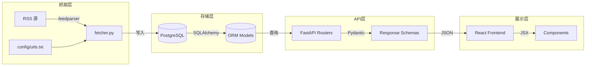
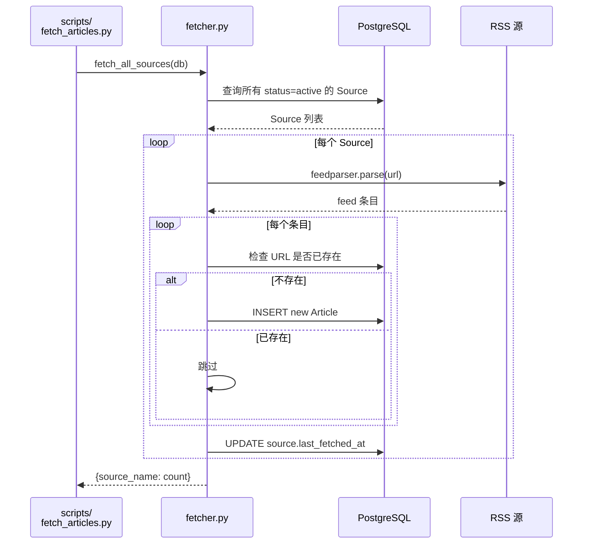
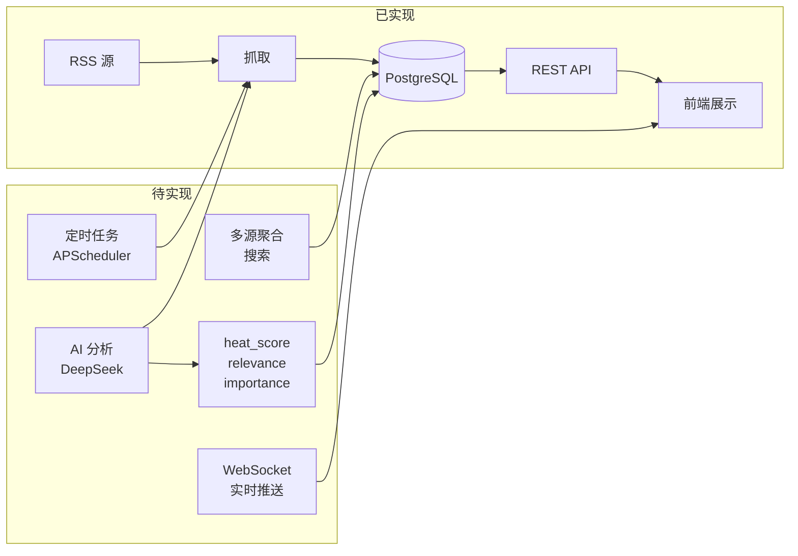

# 数据流转与对象设计

## 一、整体数据流向



---

## 二、核心对象设计

### 2.1 ORM 模型（SQLAlchemy）

定义在 `backend/app/models.py`：

```
Source ──→ Article ←── Category
  │                    │
  ├ id (PK)            ├ id (PK)
  ├ name               ├ name
  ├ url (unique)       ├ slug (unique)
  ├ type               └ sort_order
  ├ trust_score
  ├ status
  ├ last_fetched_at
  └ created_at

Article
  ├ id (PK)
  ├ title
  ├ url (unique)
  ├ source_id (FK → Source.id)
  ├ category_id (FK → Category.id)
  ├ content_text
  ├ summary
  ├ tags (ARRAY[String])
  ├ heat_score
  ├ published_at
  ├ fetched_at
  └ status
```

### 2.2 API Schema（Pydantic）

定义在 `backend/app/schemas.py`：

| Schema | 用途 | 关键字段 |
|--------|------|----------|
| `SourceCreate` | 创建源请求体 | name, url, type |
| `SourceOut` | 源列表/详情响应 | id, name, url, trust_score, status, last_fetched_at |
| `CategoryOut` | 分类列表响应 | id, name, slug, sort_order |
| `ArticleOut` | 文章列表项 | id, title, source_name, summary, heat_score, status |
| `ArticleDetail` | 文章详情 | ArticleOut + content_text |
| `PaginatedResponse` | 分页包裹 | data[], meta{page, per_page, total} |

### 2.3 字段流转对照

```
RSS XML → Article ORM → ArticleOut/ArticleDetail → JSON → React State
                                ↓
                         source_name 是通过 outerjoin 动态注入的
                         不存在于 ORM 模型中，只存在于 Schema 中
```

---

## 三、抓取流程详解



关键逻辑：
- **按 URL 去重**：同一篇文章不会重复入库
- **不修改已有文章**：如果 RSS 源更新了某篇文章内容，不会覆盖
- **幂等执行**：跑多少次都不会产生重复数据

---

## 四、API 端点清单

| 方法 | 路径 | 参数 | 响应 |
|------|------|------|------|
| GET | `/api/health` | - | `{status: "ok"}` |
| GET | `/api/articles` | page, per_page, category_id, source_id | `PaginatedResponse` |
| GET | `/api/articles/:id` | - | `ArticleDetail` |
| GET | `/api/categories` | - | `CategoryOut[]` |
| GET | `/api/sources` | - | `SourceOut[]` |
| POST | `/api/sources` | `SourceCreate` | `SourceOut` |
| DELETE | `/api/sources/:id` | - | 204 |

---

## 五、现状与规划对照

### 已有功能

```
RSS 抓取 → 存储 → API 查询 → 前端列表/详情
```

### 规划中的扩展（参考 yupi-hot-monitor）



### 需要新增的模型字段

```python
# Article 表计划新增
is_real = Column(Boolean, default=True)          # 真实性标记
relevance = Column(Integer, default=0)            # AI 相关性评分 0-100
importance = Column(String(20), default="low")    # 重要级别
relevance_reason = Column(Text, nullable=True)    # AI 分析理由
keyword_mentioned = Column(Boolean, nullable=True) # 是否直接提及关键词
```

这些字段在 yupi-hot-monitor 的 `Hotspot` 模型中已有完整实现。

---

## 六、技术关键词

| 层级 | 技术 | 职责 |
|------|------|------|
| ORM | SQLAlchemy 2.0 | 模型定义、查询构造、自动建表 |
| 序列化 | Pydantic | API 请求/响应校验和格式化 |
| Web 框架 | FastAPI | 路由分发、依赖注入、中间件 |
| 抓取 | feedparser | RSS/Atom 订阅源解析 |
| HTTP 客户端 | httpx | 备用的 HTTP 请求库 |
| 前端构建 | Vite + React Router | SPA 路由、开发代理 |
| 数据库 | PostgreSQL 16 | 持久化存储 |
