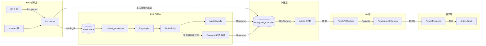
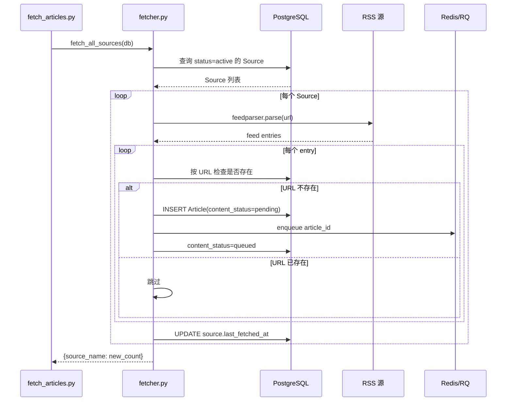
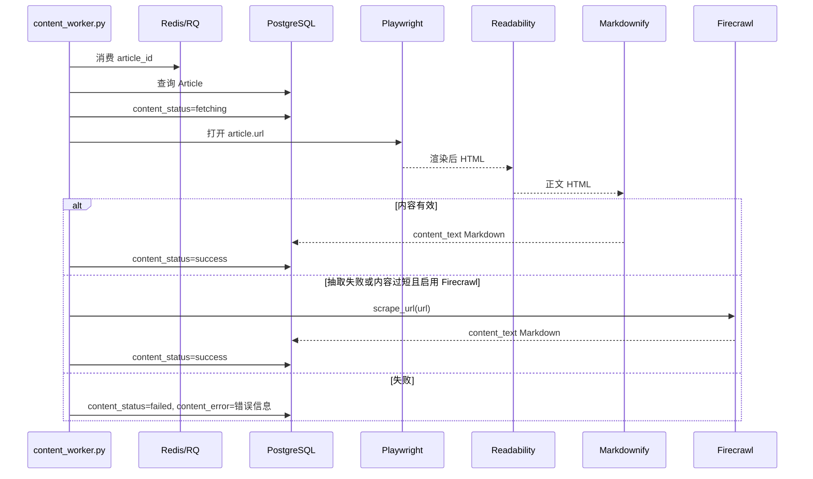

# 数据流转与对象设计

## 一、整体数据流向



## 二、核心对象设计

### 2.1 ORM 模型

定义在 `backend/app/models.py`：

```
Source
  ├ id
  ├ name
  ├ url
  ├ type
  ├ trust_score
  ├ status
  ├ last_fetched_at
  └ created_at

Category
  ├ id
  ├ name
  ├ slug
  └ sort_order

Article
  ├ id
  ├ title
  ├ source
  ├ url
  ├ date
  ├ tags
  ├ summary
  ├ content_text
  ├ content_format
  ├ content_status
  ├ content_error
  ├ content_fetched_at
  ├ content_provider
  ├ content_hash
  ├ heat_score
  ├ created_at
  └ updated_at
```

`articles.source` 是来源名称字符串，不是外键；删除 RSS 源不会删除历史文章。

### 2.2 API Schema

定义在 `backend/app/schemas.py`：

| Schema | 用途 | 关键字段 |
|--------|------|----------|
| `SourceCreate` | 创建源请求体 | name, url, type |
| `SourceOut` | 源列表/详情响应 | id, name, url, trust_score, status, last_fetched_at |
| `CategoryOut` | 分类列表响应 | id, name, slug, sort_order |
| `ArticleOut` | 文章列表项 | id, title, source, url, date, summary, heat_score |
| `ArticleDetail` | 文章详情 | ArticleOut + content_text/content_status/content_format |
| `PaginatedResponse` | 分页包裹 | data[], meta{page, per_page, total} |

## 三、RSS 抓取流程



关键逻辑：
- 按 `articles.url` 去重，保证重复执行不会重复入库。
- 队列失败不会阻断 RSS 入库，文章保持 `pending`，可后续补投。
- `fetcher.py` 只负责发现链接与投递任务，不负责同步抓正文。

## 四、正文抓取流程



## 五、脚本入口

| 脚本 | 用途 |
|------|------|
| `backend/scripts/fetch_articles.py` | 抓取 RSS 新文章并投递正文任务 |
| `backend/scripts/content_worker.py` | 启动 RQ worker 消费正文任务 |
| `backend/scripts/enqueue_pending_content.py` | 给历史或失败文章补投正文任务 |

## 六、配置流转

```text
.env
  ├ DATABASE_URL
  ├ REDIS_URL
  ├ CONTENT_QUEUE_NAME
  ├ CRAWLER_CONFIG_PATH
  ├ FIRECRAWL_API_KEY
  └ FIRECRAWL_ENABLED

config/crawler.yaml
  ├ queue
  ├ crawler
  ├ fallback
  └ domains
```

`backend/app/services/crawler_config.py` 会读取 `config/crawler.yaml`，并在配置文件缺失、格式错误或字段缺失时使用默认值。

## 七、API 到前端

```text
GET /api/articles/{id}
  ↓
ArticleDetail
  ├ content_text
  ├ content_format
  ├ content_status
  ├ content_fetched_at
  └ content_provider
  ↓
frontend/src/pages/ArticleDetail.jsx
```

当前前端按纯文本展示 `content_text`。如果后续需要更好展示 Markdown 表格和 LaTeX，可在前端加入 `react-markdown`、`remark-gfm`、`remark-math`、`rehype-katex`。
